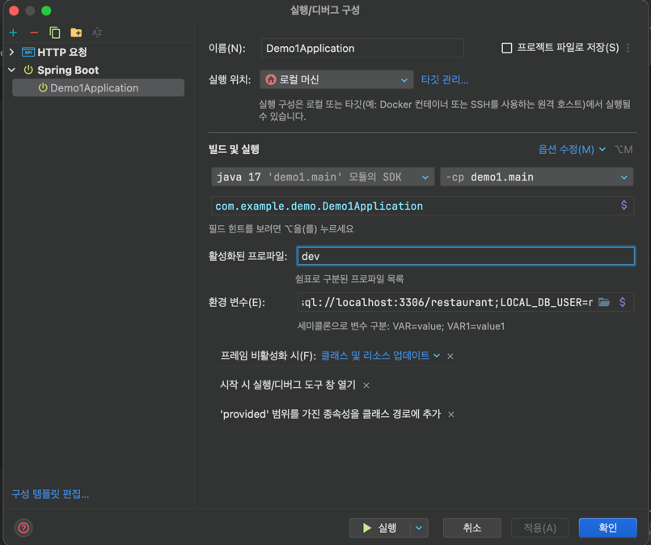

# 4주차 위클리

## 실행 및 디버그 파일

### 환경설정
`AUTO=update; 실행시 DB 데이터 유지`  
`LOCAL_DB_PW=비밀번호;`  
`LOCAL_DB_URL=jdbc:mysql://localhost:3306/restaurant;`  
`LOCAL_DB_USER=root`
## API
- order -> "/api/order" 
- menu -> "/api/menu" 
- customer -> "/api/customer" 
- store -> "/api/store" 